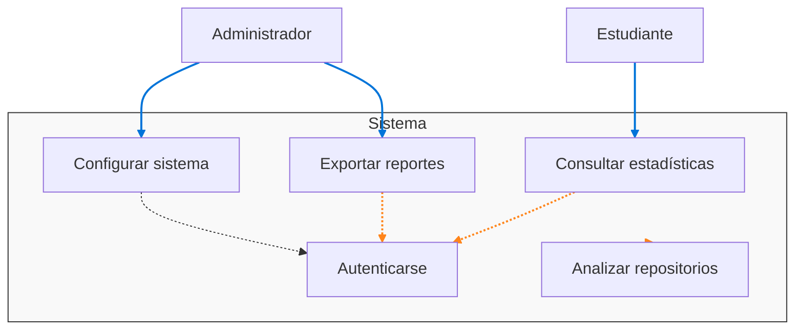
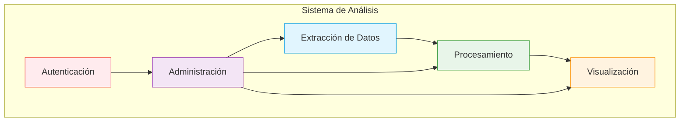
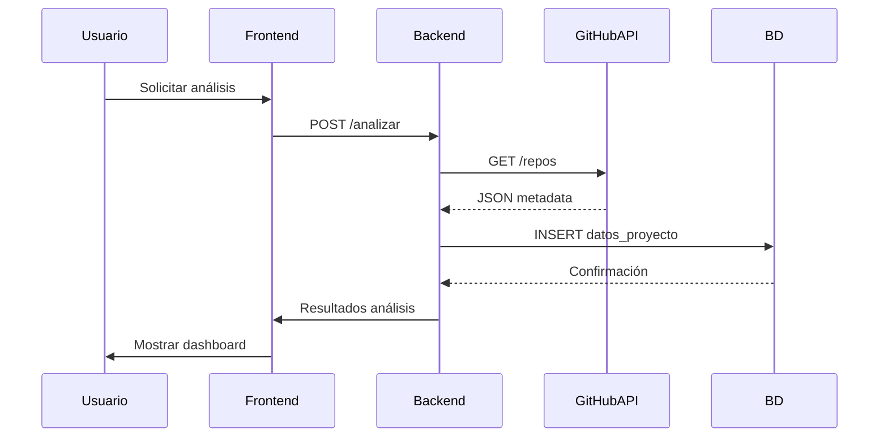
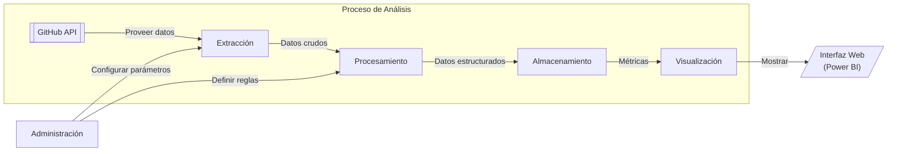
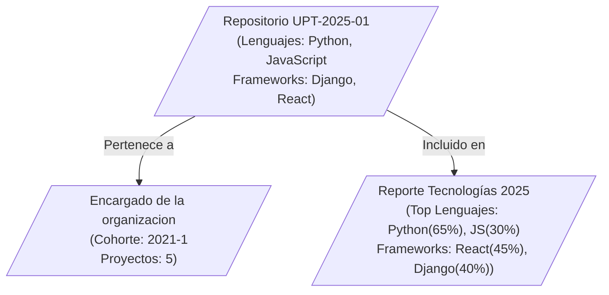
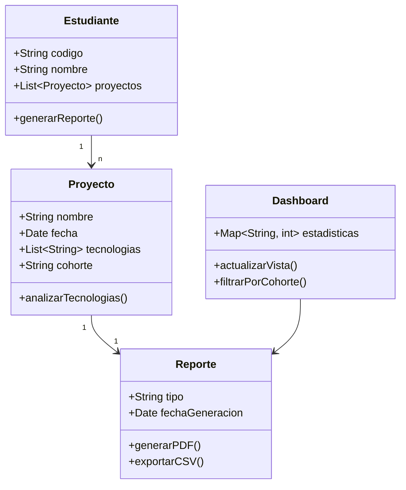
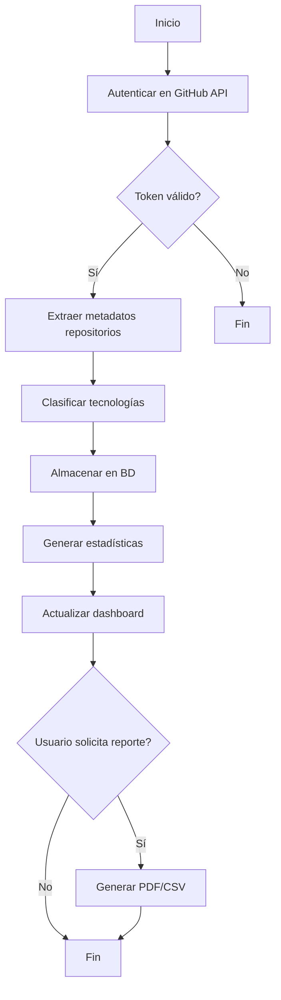
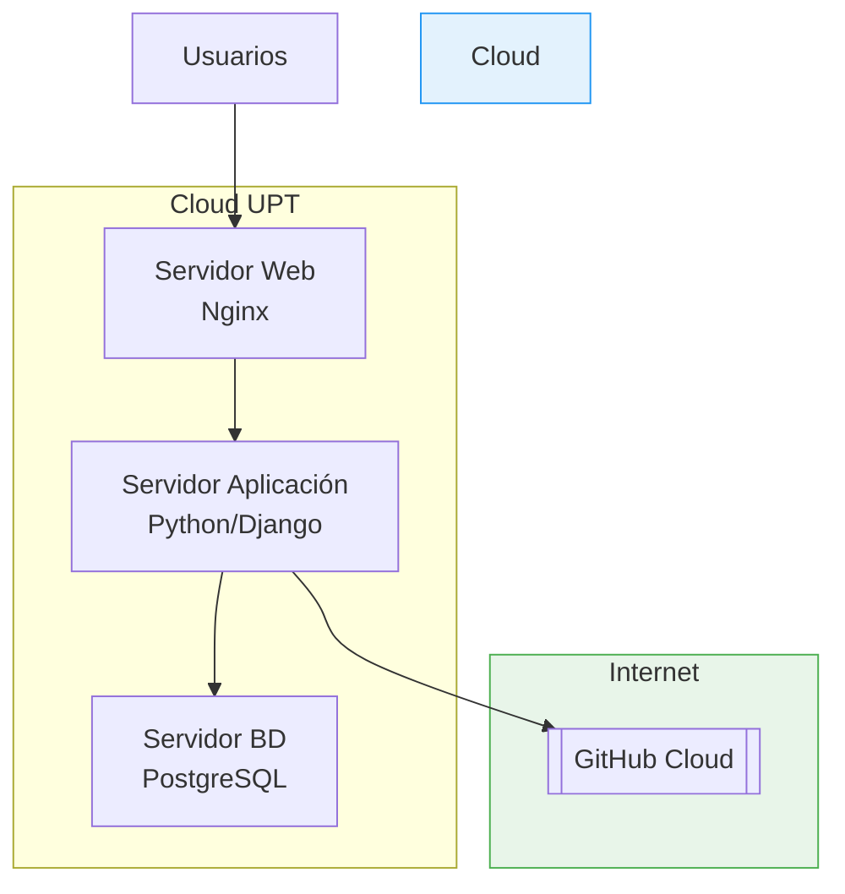

<center>


**UNIVERSIDAD PRIVADA DE TACNA**  
**FACULTAD DE INGENIERIA**  
**Escuela Profesional de Ingeniería de Sistemas**  

**Proyecto Análisis del Uso de Herramientas Tecnológicas**  

Curso: Inteligencia de Negocios  
Docente: Mag. Patrick Cuadros Quiroga  

Integrantes:  
Hernández Cruz, Angel Gadiel (2021070017)  
Paja de la Cruz, Piero Alexander (2020067576)  

**Tacna – Perú**  
**2025**  

</center>

<div style="page-break-after: always; visibility: hidden">\pagebreak</div>

**CONTROL DE VERSIONES**

| Versión | Hecha por | Revisada por | Aprobada por | Fecha       | Motivo            |
|---------|-----------|--------------|--------------|-------------|-------------------|
| 1.0     | AHC, PPC  | PCQ          | ARV          | 18/03/2025  | Versión Original  |

**Sistema Análisis de Herramientas Tecnológicas**  
**Documento de Arquitectura de Software**  
**Versión 1.0**  

<div style="page-break-after: always; visibility: hidden">\pagebreak</div>

## ÍNDICE GENERAL  

1. [INTRODUCCIÓN](#1-introducción)  
   1.1. [Propósito (Diagrama 4+1)](#11-propósito-diagrama-41)  
   1.2. [Alcance](#12-alcance)  
   1.3. [Definición, siglas y abreviaturas](#13-definición-siglas-y-abreviaturas)  
   1.4. [Organización del documento](#14-organización-del-documento)  
2. [OBJETIVOS Y RESTRICCIONES ARQUITECTÓNICAS](#2-objetivos-y-restricciones-arquitectónicas)  
   2.1. [Priorización de requerimientos](#21-priorización-de-requerimientos)  
     2.1.1. [Requerimientos Funcionales](#211-requerimientos-funcionales)  
     2.1.2. [Requerimientos No Funcionales](#212-requerimientos-no-funcionales)  
   2.2. [Restricciones](#22-restricciones)  

3. [REPRESENTACIÓN DE LA ARQUITECTURA DEL SISTEMA](#3-representación-de-la-arquitectura-del-sistema)  
   3.1. [Vista de Caso de uso](#31-vista-de-caso-de-uso)  
     3.1.1. [Diagramas de Casos de uso](#311-diagramas-de-casos-de-uso)  
   3.2. [Vista Lógica](#32-vista-lógica)  
     3.2.1. [Diagrama de Subsistemas](#321-diagrama-de-subsistemas)  
     3.2.2. [Diagrama de Secuencia](#322-diagrama-de-secuencia)  
     3.2.3. [Diagrama de Colaboración](#323-diagrama-de-colaboración)  
     3.2.4. [Diagrama de Objetos](#324-diagrama-de-objetos)  
     3.2.5. [Diagrama de Clases](#325-diagrama-de-clases)  
     3.2.6. [Diagrama de Base de datos](#326-diagrama-de-base-de-datos)  
   3.3. [Vista de Implementación](#33-vista-de-implementación)  
     3.3.1. [Diagrama de arquitectura software](#331-diagrama-de-arquitectura-software)  
     3.3.2. [Diagrama de arquitectura del sistema](#332-diagrama-de-arquitectura-del-sistema)  
   3.4. [Vista de procesos](#34-vista-de-procesos)  
     3.4.1. [Diagrama de Procesos del sistema](#341-diagrama-de-procesos-del-sistema)  
   3.5. [Vista de Despliegue](#35-vista-de-despliegue)  
     3.5.1. [Diagrama de despliegue](#351-diagrama-de-despliegue)  

4. [ATRIBUTOS DE CALIDAD DEL SOFTWARE](#4-atributos-de-calidad-del-software)  
   - [Escenario de Funcionalidad](#escenario-de-funcionalidad)  
   - [Escenario de Usabilidad](#escenario-de-usabilidad)  
   - [Escenario de confiabilidad](#escenario-de-confiabilidad)  
   - [Escenario de rendimiento](#escenario-de-rendimiento)  
   - [Escenario de mantenibilidad](#escenario-de-mantenibilidad)  
   - [Otros Escenarios](#otros-escenarios)  

<div style="page-break-after: always; visibility: hidden">\pagebreak</div>

## 1. INTRODUCCIÓN  

### 1.1. Propósito (Diagrama 4+1)  
Se presenta una visión global y resumida de la arquitectura del sistema y de los objetivos generales del diseño. Se describen las influencias con los requisitos funcionales y no funcionales del sistema y las decisiones y prioridades establecidas – eficiencia vs. Portabilidad, por ejemplo.

### 1.2. Alcance  
El documento se centrará en el desarrollo de la vista lógica del framework. Se incluyen los aspectos fundamentales del resto de las vistas y se omiten aquellas que no se consideren pertinentes como ser el caso de la vista de procesos.

### 1.3. Definición, siglas y abreviaturas  

| Término | Definición |
|---------|------------|
| UPT     | Universidad Privada de Tacna |
| CI/CD   | Integración Continua/Despliegue Continuo |
| QA      | Atributo de Calidad |
| RF      | Requerimiento Funcional |
| RNF     | Requerimiento No Funcional |

### 1.4. Organización del documento  
El documento está organizado en cuatro secciones principales: Introducción, Objetivos y Restricciones, Representación de la Arquitectura, y Atributos de Calidad. Cada sección desarrolla aspectos específicos del diseño arquitectónico del sistema.

<div style="page-break-after: always; visibility: hidden">\pagebreak</div>

## 2. OBJETIVOS Y RESTRICCIONES ARQUITECTÓNICAS  

### 2.1. Priorización de requerimientos  

#### 2.1.1. Requerimientos Funcionales  

| ID   | Descripción | Prioridad |
|------|-------------|-----------|
| RF01 | Sistema debe permitir registro de herramientas tecnológicas | Alta |
| RF02 | Sistema debe generar reportes de análisis | Media |
| RF03 | Sistema debe autenticar usuarios | Crítica |

#### 2.1.2. Requerimientos No Funcionales  

| ID    | Descripción | Prioridad |
|-------|-------------|-----------|
| RNF01 | Tiempo de respuesta < 2 segundos | Alta |
| RNF02 | Disponibilidad 99.5% | Crítica |
| RNF03 | Soporte para 50 usuarios concurrentes | Media |

Los Atributos de Calidad (QAs) son propiedades medibles y evaluables de un sistema, estas propiedades son usadas para indicar el grado en que el sistema satisface las necesidades de los stakeholders [Wojcik 2013]. Los QAs además son concebidos como aquellos requerimientos que no son funcionales.

### 2.2. Restricciones  
- Presupuesto limitado a S/. 15,000
- Tiempo de desarrollo máximo de 4 meses
- Debe integrarse con sistemas legacy existentes

<div style="page-break-after: always; visibility: hidden">\pagebreak</div>

## 3. REPRESENTACIÓN DE LA ARQUITECTURA DEL SISTEMA

### 3.1. Vista de Caso de uso



#### 3.1.1. Diagramas de Casos de uso
La estructura del sistema se ilustra mediante un conjunto de casos de uso que generan una vista completa de las interacciones. Estos escenarios describen secuencias de operaciones entre objetos y procesos, sirviendo para validar el diseño arquitectónico. Los casos de uso principales incluyen: registro de herramientas, generación de reportes y gestión de usuarios.

### 3.2. Vista Lógica
Esta vista representa los requerimientos funcionales del sistema, describiendo los componentes significativos del modelo de diseño como subsistemas, paquetes y clases.

#### 3.2.1. Diagrama de Subsistemas (paquetes)


#### 3.2.2. Diagrama de Secuencia (vista de diseño)


#### 3.2.3. Diagrama de Colaboración (vista de diseño)


#### 3.2.4. Diagrama de Objetos


#### 3.2.5. Diagrama de Clases


#### 3.2.6. Diagrama de Base de datos (relacional)
```mermaid

```

### 3.3. Vista de Implementación
```mermaid

```

#### 3.3.1. Diagrama de arquitectura software (paquetes)
```mermaid

```

#### 3.3.2. Diagrama de arquitectura del sistema (Diagrama de componentes)
```mermaid
flowchart TD
    Cliente[Cliente Web] --> API[API REST]
    API --> ServAuth[Servicio Autenticación]
    API --> ServAnalisis[Servicio Análisis]
    ServAnalisis --> GitHub[GitHub API]
    ServAnalisis --> BD[(Base de Datos)]
    API --> PowerBI[Power BI Embedded]
```

### 3.4. Vista de procesos
Describe los procesos pesados del sistema y su interacción.

#### 3.4.1. Diagrama de Procesos del sistema (diagrama de actividad)

### 3.5. Vista de Despliegue
Describe la distribución física del sistema en los entornos de producción.

#### 3.5.1. Diagrama de despliegue

## 4. ATRIBUTOS DE CALIDAD DEL SOFTWARE

Los Atributos de Calidad (QAs) son propiedades medibles y evaluables del sistema que determinan cómo satisface las necesidades de los stakeholders. Estos requerimientos no funcionales son críticos para el éxito de la solución.

### Escenario de Funcionalidad
El sistema debe cumplir con el conjunto completo de funcionalidades especificadas, incluyendo:
- Capacidad para registrar y clasificar herramientas tecnológicas
- Generación de reportes con métricas de análisis
- Gestión de usuarios y permisos
- Seguridad en el procesamiento de datos

### Escenario de Usabilidad
La interfaz debe garantizar:
- Curva de aprendizaje menor a 30 minutos para usuarios básicos
- Diseño intuitivo siguiendo estándares de UX
- Mensajes de error claros y orientados a solución
- Adaptabilidad a diferentes dispositivos (responsive design)

### Escenario de Confiabilidad
El sistema debe mantener:
- Disponibilidad del 99.5% en horario laboral
- Tolerancia a fallos en componentes no críticos
- Mecanismos de recuperación ante caídas
- Integridad de datos garantizada mediante transacciones ACID

### Escenario de Rendimiento
Parámetros técnicos requeridos:
- Tiempo de respuesta < 2 segundos para el 95% de las peticiones
- Soporte para 50 usuarios concurrentes sin degradación
- Procesamiento de análisis en lotes sin bloquear interfaz
- Carga inicial de interfaz < 3 segundos

### Escenario de Mantenibilidad
Características de diseño para evolución:
- Código documentado siguiendo estándares
- Arquitectura modular con bajo acoplamiento
- Pruebas unitarias cubriendo >80% del código
- Documentación técnica actualizada

### Otros Escenarios
**Escalabilidad:**
- Capacidad de aumentar capacidad de procesamiento en 50% sin rediseño
- Crecimiento modular de almacenamiento

**Seguridad:**
- Autenticación con doble factor opcional
- Cifrado de datos sensibles en tránsito y reposo
- Registro de auditoría de actividades críticas

**Portabilidad:**
- Compatibilidad con navegadores Chrome, Edge y Firefox
- Soporte para despliegue en entornos On-Premise y Cloud